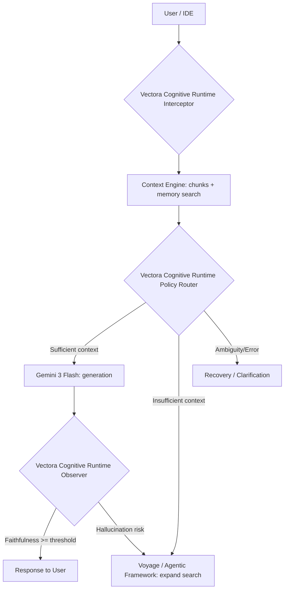
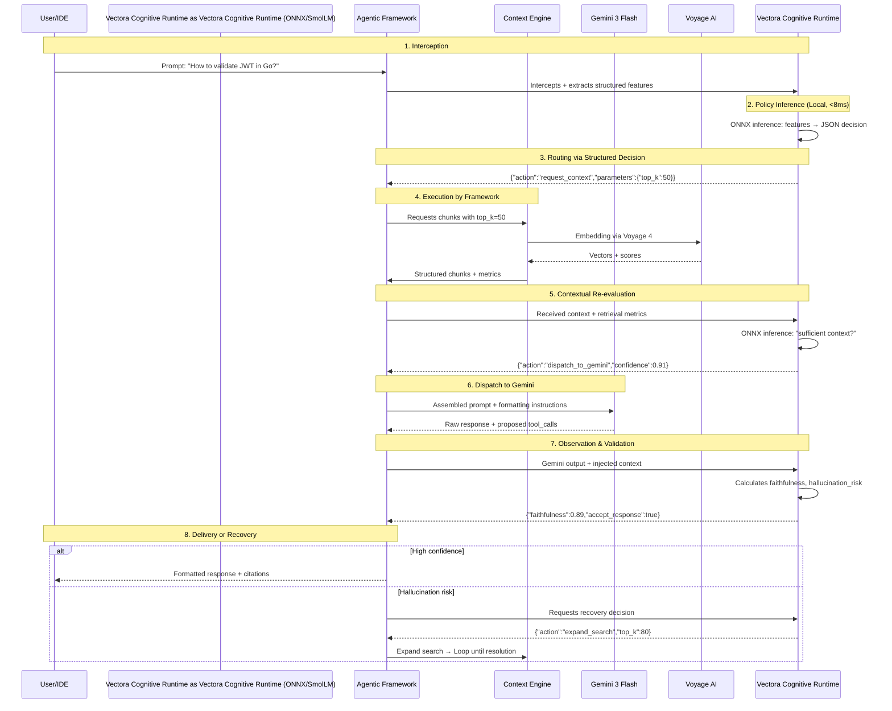



The **Vectora Decision Engine (Vectora Cognitive Runtime)** is the cognitive layer specialized in contextual decision-making within Vectora. It acts as a **Policy Orchestrator & Observer**, intercepting prompts, enriching them with structured context, and observing the outputs of external models to validate quality, detect hallucinations, and orchestrate the agent's lifecycle.

> [!IMPORTANT]
> The Vectora Cognitive Runtime is a specialized **Policy Model**. It does not replace a general-purpose LLM. Its purpose is to transform context and state metrics into structured, auditable, and optimizable decisions, ensuring Gemini and Voyage receive exactly what they need.

## Role in the Architecture

The Vectora Cognitive Runtime operates as the intermediate control layer, ensuring contextual validation at all stages of the flow:



## Core Capabilities

| Capability                   | Description                                                                    | Output Example                                              |
| :--------------------------- | :----------------------------------------------------------------------------- | :---------------------------------------------------------- |
| **Interception & Assembly**  | Injects relevant chunks, session memory, and formatting instructions           | `{"assembled_prompt": "...", "injected_tokens": 1420}`      |
| **Smart Routing**            | Decides target: Gemini (generation), Voyage (embedding) or Agentic Framework   | `{"next_target": "gemini", "reason": "semantic_synthesis"}` |
| **Observation & Validation** | Compares output with context, calculates _faithfulness_ and hallucination risk | `{"faithfulness": 0.89, "hallucination_flag": false}`       |
| **Meta-Control (Recovery)**  | Automatically decides: retry, search expansion, or context compaction          | `{"action": "expand_search", "top_k": 80}`                  |
| **Decision Normalization**   | Transforms reasoning into auditable JSON for logs and metrics                  | `{"decision_type": "tool_dispatch", "trace_id": "abc123"}`  |

## Model Specification

The Vectora Cognitive Runtime utilizes a modern Small Language Model (SLM), optimized for local inference via ONNX.

| Component          | Specification                                                     |
| :----------------- | :---------------------------------------------------------------- |
| **Base Model**     | `HuggingFaceTB/SmolLM2-135M`                                      |
| **Architecture**   | Decoder-only (12L, 576H, 12Attn, RoPE + SwiGLU + RMSNorm)         |
| **License**        | Apache 2.0 (commercial use, free modification and redistribution) |
| **Fine-Tuning**    | Supervised Fine-Tuning (SFT) + LoRA (`r=16, α=32`)                |
| **Runtime**        | ONNX (INT4) via `onnxruntime-go`                                  |
| **Target Latency** | ≤ 8ms p95 (Local CPU)                                             |
| **Size on Disk**   | ~35MB (quantized INT4)                                            |

> [!NOTE] > **Why SmolLM2-135M?** This model offers the exact balance between SOTA architecture (modern decoder-only) and a viable footprint for local CPU inference, ensuring tactical decisions without network dependency.

## Training & Calibration

The Vectora Cognitive Runtime produces **structured decisions with calibrated confidence**, fundamental for meta-control.

### Training Pipeline

- **Dataset**: 5k–10k real Vectora traces + 15k synthetic failure examples (low precision, ambiguous context).
- **Method**: SFT with LoRA (trains ~1.2M params, 0.9% of total). Converges in <2h on CPU.
- **Calibration**: Platt scaling + temperature scaling to ensure that `confidence: 0.80` ≈ 80% real accuracy (ECE ≤ 0.05).

### Structured Output Format

```json
{
  "action": "dispatch_to_gemini",
  "parameters": { "temperature": 0.3, "max_tokens": 1500 },
  "confidence": 0.88,
  "observation": { "context_sufficiency": 0.91, "requires_tool": false }
}
```

## Runtime & Fallback

The Vectora Cognitive Runtime runs **100% locally** in the Vectora Go binary, eliminating network latency in critical decisions.

```yaml
vectora-cognitive-runtime_runtime:
  engine: "onnxruntime-go (pre-allocated, zero GC overhead)"
  quantization: "INT4 (weights_symmetric=True, activations=FP16)"
  fallback_policy:
    trigger: "inference_timeout > 15ms OR confidence < 0.50"
    action: "fallback_to_heuristics"
```

## Configuration

Enabled by default in the Plus plan and optional in BYOK via `vectora.config.yaml`:

```yaml
vectora-cognitive-runtime:
  enabled: true
  model_path: "models/vectora-cognitive-runtime-policy-v1-int4.onnx"
  confidence_threshold: 0.70 # Threshold to trigger clarification or fallback
  max_inference_ms: 15 # Safety timeout before fallback
  logging: true # Records decisions for continuous retraining
```

## Success Metrics

| Metric                | Target       | Product Impact                            |
| :-------------------- | :----------- | :---------------------------------------- |
| **Decision Accuracy** | ≥ 85%        | Accurate routing, fewer unnecessary loops |
| **Inference Latency** | ≤ 8ms        | Zero perceptible UX degradation (Desktop) |
| **Token Efficiency**  | -15% / query | Rigorous context filtering before Gemini  |
| **Calibration Error** | ≤ 0.05       | Realistic confidence for meta-control     |

This documentation details how the **Vectora Decision Engine (Vectora Cognitive Runtime)** interacts with other system components. The fundamental principle is that the Vectora Cognitive Runtime acts as a pure inference engine producing structured decisions, delegating physical execution to the Agentic Framework.

The Vectora Cognitive Runtime never makes direct network calls. It intercepts, observes, and validates, ensuring that the data flow between the Context Engine and external models (Gemini, Voyage) is secure and optimized.

## Communication Diagram: Vectora Cognitive Runtime as Policy Orchestrator

The diagram below illustrates the lifecycle of a request and how the Vectora Cognitive Runtime orchestrates decision policies at each stage:



## Communication Pattern: Structured Decisions

The Vectora Cognitive Runtime communicates through strictly typed JSON objects that define the next tactical action. This separation between decision and execution allows the inference engine to be replaced or retrained without changing the core logic of the Agentic Framework.

### Vectora Cognitive Runtime Decision Schema (Output)

Each decision produced by the Vectora Cognitive Runtime follows a pattern that includes the action, recommended parameters, and confidence metrics:

```json
{
  "trace_id": "vectora-cognitive-runtime_20260420_abc123",
  "timestamp": "2026-04-20T14:32:01Z",

  "decision": {
    "action": "dispatch_to_gemini",
    "target": "gemini",
    "parameters": {
      "temperature": 0.2,
      "max_tokens": 1500,
      "enforce_json_schema": true,
      "system_prompt_variant": "code_expert"
    },
    "confidence": 0.91
  },

  "observation": {
    "context_sufficiency": 0.94,
    "hallucination_risk": 0.07,
    "requires_tool_before_response": false
  },

  "recovery_hint": {
    "if_failed": "expand_search",
    "fallback_top_k": 80,
    "max_retry_attempts": 2
  },

  "metadata": {
    "model_version": "vectora-cognitive-runtime-policy-v1-int4",
    "inference_latency_ms": 4.2,
    "feature_hash": "a1b2c3d4"
  }
}
```

### Agentic Framework Implementation

The Agentic Framework acts as the faithful executor of Vectora Cognitive Runtime decisions, mapping actions to system calls or external providers:

```go
// cloud/internal/agentic_framework/vectora-cognitive-runtime_router.go
type Vectora Cognitive RuntimeDecision struct {
    Action     string            `json:"action"`
    Target     string            `json:"target"`
    Parameters map[string]any    `json:"parameters"`
    Confidence float32           `json:"confidence"`
    Observation struct {
        ContextSufficiency float32 `json:"context_sufficiency"`
        HallucinationRisk  float32 `json:"hallucination_risk"`
    } `json:"observation"`
}

func (af *AgenticFramework) ExecuteVectora Cognitive RuntimeDecision(dec Vectora Cognitive RuntimeDecision) error {
    switch dec.Action {
    case "request_context":
        return af.requestContext(dec.Parameters)

    case "dispatch_to_gemini":
        if dec.Confidence < af.config.Vectora Cognitive RuntimeConfidenceThreshold {
            return af.triggerClarification(dec)
        }
        return af.dispatchToGemini(dec.Parameters)

    case "call_tool":
        return af.executeTool(dec.Parameters["tool_name"].(string), dec.Parameters)

    case "expand_search":
        return af.expandRetrieval(dec.Parameters)

    case "accept_response":
        return af.deliverResponse(dec.Observation)

    default:
        return af.fallbackHeuristic(dec)
    }
}
```

## Strategic Observation Points

The Vectora Cognitive Runtime does not passively observe the system in real-time. It acts at specific control points where it receives structured snapshots of the pipeline state.

| Point           | Data Capture                                         | Resulting Decision                                                  |
| --------------- | ---------------------------------------------------- | ------------------------------------------------------------------- |
| **Pre-Gemini**  | Assembled prompt, injected chunks, retrieval metrics | `accept_prompt` / `expand_context` / `compact_noise`                |
| **Post-Gemini** | Raw response, proposed tool_calls, tokens generated  | `accept_response` / `flag_hallucination` / `request_tool_execution` |
| **Post-Tool**   | Tool result, schema validation, latency              | `accept_tool_result` / `retry_tool` / `fallback_heuristic`          |

### Example: Post-Gemini Validation

At this point, the Vectora Cognitive Runtime calculates **Faithfulness Evaluation** metrics to ensure that Gemini's response is properly grounded in the injected context chunks.

```json
{
  "snapshot_type": "post_gemini",
  "gemini_output": {
    "text": "To validate JWT in Go, use the github.com/golang-jwt/jwt/v4 package...",
    "citations": ["src/auth/jwt.go:42", "src/middleware/auth.go:18"]
  },
  "injected_context": {
    "chunks": [{ "file": "src/auth/jwt.go", "content_preview": "func VerifyToken...", "relevance": 0.92 }]
  },
  "metrics": {
    "faithfulness_estimate": 0.89,
    "hallucination_signals": ["no_unsupported_claims"]
  }
}
```

## Security and Isolation

This architectural separation between decision and execution brings critical security benefits. Since the Vectora Cognitive Runtime runs locally via **ONNX Runtime Go**, there is no risk of API keys or secrets exposure during the tactical inference phase.

- **Zero Network Calls**: The Vectora Cognitive Runtime processes only what the Agentic Framework provides.
- **Full Auditability**: Each decision is logged as JSON, allowing precise audits of why an agent took a specific action.
- **Resilience**: If local inference fails, the Agentic Framework uses hardcoded fallback policies.

## External Linking

| Concept               | Resource                            | Link                                                                                 |
| --------------------- | ----------------------------------- | ------------------------------------------------------------------------------------ |
| **Gemini AI**         | Google DeepMind Gemini Models       | [deepmind.google/technologies/gemini/](https://deepmind.google/technologies/gemini/) |
| **Gemini API**        | Google AI Studio Documentation      | [ai.google.dev/docs](https://ai.google.dev/docs)                                     |
| **Voyage AI**         | High-performance embeddings for RAG | [www.voyageai.com/](https://www.voyageai.com/)                                       |
| **Voyage Embeddings** | Voyage Embeddings Documentation     | [docs.voyageai.com/docs/embeddings](https://docs.voyageai.com/docs/embeddings)       |
| **Voyage Reranker**   | Voyage Reranker API                 | [docs.voyageai.com/docs/reranker](https://docs.voyageai.com/docs/reranker)           |
| **Anthropic Claude**  | Claude Documentation                | [docs.anthropic.com/](https://docs.anthropic.com/)                                   |

---

**Vectora v0.1.0** · [GitHub](https://github.com/Kaffyn/Vectora) · [License (MIT)](https://github.com/Kaffyn/Vectora/blob/master/LICENSE) · [Contributors](https://github.com/Kaffyn/Vectora/graphs/contributors)

_Part of the Vectora AI Agent ecosystem. Built with [ADK](https://adk.dev/), [Claude](https://claude.ai/), and [Go](https://golang.org/)._

© 2026 Vectora Contributors. All rights reserved.

---

_Part of the Vectora ecosystem_ · [Open Source (MIT)](https://github.com/Kaffyn/Vectora) · [Contributors](https://github.com/Kaffyn/Vectora/graphs/contributors)
