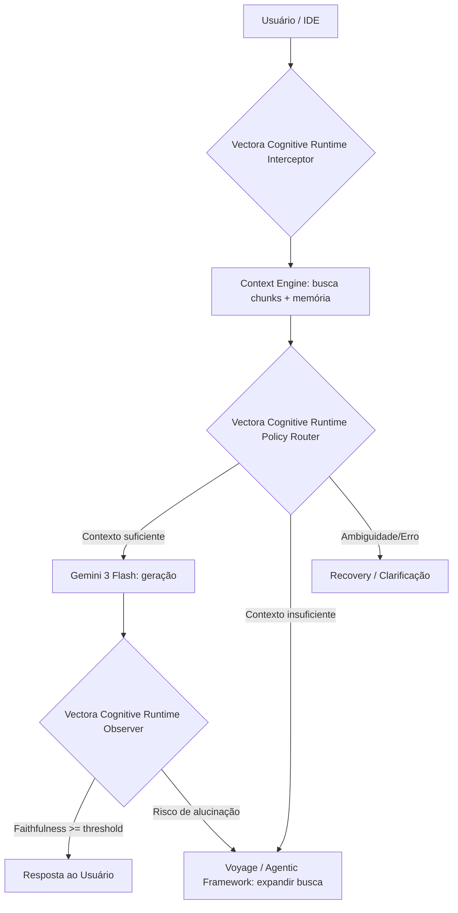
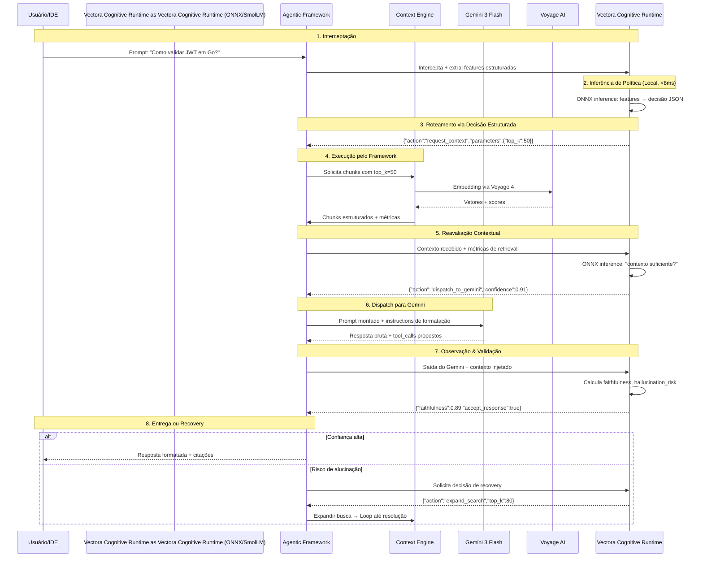



O **Vectora Decision Engine (Vectora Cognitive Runtime)** é a camada cognitiva especializada em decisão contextual do Vectora. Ele atua como um **Policy Orchestrator & Observer**, interceptando prompts, enriquecendo-os com contexto estruturado e observando as saídas dos modelos externos para validar qualidade, detectar alucinações e orquestrar o ciclo de vida do agente.

> [!IMPORTANT]
> O Vectora Cognitive Runtime é um **Policy Model** especializado. Ele não substitui uma LLM generalista. Seu propósito é transformar contexto e métricas de estado em decisões estruturadas, auditáveis e otimizáveis, garantindo que o Gemini e o Voyage recebam exatamente o que precisam.

## Papel na Arquitetura

O Vectora Cognitive Runtime opera como a camada de controle intermediária, garantindo validação contextual em todas as etapas do fluxo:



## Capacidades Principais

| Capacidade                   | Descrição                                                                   | Exemplo de Saída                                            |
| :--------------------------- | :-------------------------------------------------------------------------- | :---------------------------------------------------------- |
| **Interceptação & Montagem** | Injeta chunks relevantes, memória de sessão e instruções de formatação      | `{"assembled_prompt": "...", "injected_tokens": 1420}`      |
| **Roteamento Inteligente**   | Decide o destino: Gemini (geração), Voyage (embedding) ou Agentic Framework | `{"next_target": "gemini", "reason": "semantic_synthesis"}` |
| **Observação & Validação**   | Compara saída com contexto, calcula _faithfulness_ e risco de alucinação    | `{"faithfulness": 0.89, "hallucination_flag": false}`       |
| **Meta-Controle (Recovery)** | Decide automaticamente: retry, expandir busca ou compactar contexto         | `{"action": "expand_search", "top_k": 80}`                  |
| **Normalização de Decisões** | Transforma raciocínio em JSON auditável para logs e métricas                | `{"decision_type": "tool_dispatch", "trace_id": "abc123"}`  |

## Especificação do Modelo

O Vectora Cognitive Runtime utiliza um Small Language Model (SLM) moderno, otimizado para inferência local via ONNX.

| Componente           | Especificação                                                  |
| :------------------- | :------------------------------------------------------------- |
| **Modelo Base**      | `HuggingFaceTB/SmolLM2-135M`                                   |
| **Arquitetura**      | Decoder-only (12L, 576H, 12Attn, RoPE + SwiGLU + RMSNorm)      |
| **Licença**          | Apache 2.0 (uso comercial, modificação e redistribuição livre) |
| **Fine-Tuning**      | Supervised Fine-Tuning (SFT) + LoRA (`r=16, α=32`)             |
| **Runtime**          | ONNX (INT4) via `onnxruntime-go`                               |
| **Latência Alvo**    | ≤ 8ms p95 (CPU Local)                                          |
| **Tamanho em Disco** | ~35MB (quantizado INT4)                                        |

> [!NOTE] > **Por que SmolLM2-135M?** Este modelo oferece o equilíbrio exato entre arquitetura SOTA (decoder-only moderno) e footprint viável para inferência local em CPU, garantindo decisões táticas sem dependência de rede.

## Treinamento & Calibração

O Vectora Cognitive Runtime produz **decisões estruturadas com confiança calibrada**, fundamentais para o meta-controle.

### Pipeline de Treino

- **Dataset**: 5k–10k traces reais do Vectora + 15k exemplos sintéticos de falha (baixa precisão, contexto ambíguo).
- **Método**: SFT com LoRA (treina ~1.2M params, 0.9% do total). Converge em <2h em CPU.
- **Calibração**: Platt scaling + temperature scaling para garantir que `confidence: 0.80` ≈ 80% de acurácia real (ECE ≤ 0.05).

### Formato de Saída Estruturado

```json
{
  "action": "dispatch_to_gemini",
  "parameters": { "temperature": 0.3, "max_tokens": 1500 },
  "confidence": 0.88,
  "observation": { "context_sufficiency": 0.91, "requires_tool": false }
}
```

## Runtime & Fallback

O Vectora Cognitive Runtime roda **100% localmente** no binário Go do Vectora, eliminando latência de rede em decisões críticas.

```yaml
vectora-cognitive-runtime_runtime:
  engine: "onnxruntime-go (pré-alocado, zero GC overhead)"
  quantization: "INT4 (weights_symmetric=True, activations=FP16)"
  fallback_policy:
    trigger: "inference_timeout > 15ms OR confidence < 0.50"
    action: "fallback_to_heuristics"
```

## Configuração

Habilitado por padrão no plano Plus e opcional no BYOK via `vectora.config.yaml`:

```yaml
vectora-cognitive-runtime:
  enabled: true
  model_path: "models/vectora-cognitive-runtime-policy-v1-int4.onnx"
  confidence_threshold: 0.70 # Threshold para acionar clarificação ou fallback
  max_inference_ms: 15 # Timeout de segurança antes do fallback
  logging: true # Grava decisões para retreino contínuo
```

## Métricas de Sucesso

| Métrica               | Target       | Impacto no Produto                             |
| :-------------------- | :----------- | :--------------------------------------------- |
| **Decision Accuracy** | ≥ 85%        | Roteamento preciso, menos loops desnecessários |
| **Inference Latency** | ≤ 8ms        | Zero degradação perceptível na UX (Desktop)    |
| **Token Efficiency**  | -15% / query | Filtragem rigorosa de contexto antes do Gemini |
| **Calibration Error** | ≤ 0.05       | Confiança realista para o meta-controle        |
| **Fallback Rate**     | ≤ 2%         | Estabilidade em produção sob carga variável    |

Esta seção detalha como o **Vectora Decision Engine (Vectora Cognitive Runtime)** interage com os outros componentes do sistema. O princípio fundamental é que o Vectora Cognitive Runtime atua como um motor de inferência puro que produz decisões estruturadas, delegando a execução física para o Agentic Framework.

O Vectora Cognitive Runtime nunca faz chamadas de rede diretas. Ele intercepta, observa e valida, garantindo que o fluxo de dados entre o Context Engine e os modelos externos (Gemini, Voyage) seja seguro e otimizado.

## Diagrama de Comunicação: Vectora Cognitive Runtime como Policy Orchestrator

O diagrama abaixo ilustra o ciclo de vida de uma requisição e como o Vectora Cognitive Runtime orquestra as políticas de decisão em cada etapa:



## Padrão de Comunicação: Decisões Estruturadas

O Vectora Cognitive Runtime comunica-se através de objetos JSON estritamente tipados que definem a próxima ação tática. Esta separação entre decisão e execução permite que o motor de inferência seja substituído ou retreinado sem alterar a lógica principal do Agentic Framework.

### Schema de Decisão do Vectora Cognitive Runtime (Output)

Cada decisão produzida pelo Vectora Cognitive Runtime segue um padrão que inclui a ação, parâmetros recomendados e métricas de confiança:

```json
{
  "trace_id": "vectora-cognitive-runtime_20260420_abc123",
  "timestamp": "2026-04-20T14:32:01Z",

  "decision": {
    "action": "dispatch_to_gemini",
    "target": "gemini",
    "parameters": {
      "temperature": 0.2,
      "max_tokens": 1500,
      "enforce_json_schema": true,
      "system_prompt_variant": "code_expert"
    },
    "confidence": 0.91
  },

  "observation": {
    "context_sufficiency": 0.94,
    "hallucination_risk": 0.07,
    "requires_tool_before_response": false
  },

  "recovery_hint": {
    "if_failed": "expand_search",
    "fallback_top_k": 80,
    "max_retry_attempts": 2
  },

  "metadata": {
    "model_version": "vectora-cognitive-runtime-policy-v1-int4",
    "inference_latency_ms": 4.2,
    "feature_hash": "a1b2c3d4"
  }
}
```

### Implementação no Agentic Framework

O Agentic Framework atua como o executor fiel das decisões do Vectora Cognitive Runtime, mapeando as ações para chamadas de sistema ou provedores externos:

```go
// cloud/internal/agentic_framework/vectora-cognitive-runtime_router.go
type Vectora Cognitive RuntimeDecision struct {
    Action     string            `json:"action"`
    Target     string            `json:"target"`
    Parameters map[string]any    `json:"parameters"`
    Confidence float32           `json:"confidence"`
    Observation struct {
        ContextSufficiency float32 `json:"context_sufficiency"`
        HallucinationRisk  float32 `json:"hallucination_risk"`
    } `json:"observation"`
}

func (af *AgenticFramework) ExecuteVectora Cognitive RuntimeDecision(dec Vectora Cognitive RuntimeDecision) error {
    switch dec.Action {
    case "request_context":
        return af.requestContext(dec.Parameters)

    case "dispatch_to_gemini":
        if dec.Confidence < af.config.Vectora Cognitive RuntimeConfidenceThreshold {
            return af.triggerClarification(dec)
        }
        return af.dispatchToGemini(dec.Parameters)

    case "call_tool":
        return af.executeTool(dec.Parameters["tool_name"].(string), dec.Parameters)

    case "expand_search":
        return af.expandRetrieval(dec.Parameters)

    case "accept_response":
        return af.deliverResponse(dec.Observation)

    default:
        return af.fallbackHeuristic(dec)
    }
}
```

## Pontos de Observação Estratégica

O Vectora Cognitive Runtime não observa o sistema em tempo real de forma passiva. Ele atua em pontos de controle específicos onde recebe snapshots estruturados do estado do pipeline.

| Ponto          | Captura de Dados                                        | Decisão Resultante                                                  |
| -------------- | ------------------------------------------------------- | ------------------------------------------------------------------- |
| **Pré-Gemini** | Prompt montado, chunks injetados, métricas de retrieval | `accept_prompt` / `expand_context` / `compact_noise`                |
| **Pós-Gemini** | Resposta bruta, tool_calls propostos, tokens gerados    | `accept_response` / `flag_hallucination` / `request_tool_execution` |
| **Pós-Tool**   | Resultado da ferramenta, validação de schema, latência  | `accept_tool_result` / `retry_tool` / `fallback_heuristic`          |

### Exemplo: Validação Pós-Gemini

Neste ponto, o Vectora Cognitive Runtime calcula métricas de **Faithfulness Evaluation** para garantir que a resposta do Gemini está devidamente fundamentada nos chunks de contexto injetados.

```json
{
  "snapshot_type": "post_gemini",
  "gemini_output": {
    "text": "Para validar JWT em Go, use o pacote github.com/golang-jwt/jwt/v4...",
    "citations": ["src/auth/jwt.go:42", "src/middleware/auth.go:18"]
  },
  "injected_context": {
    "chunks": [{ "file": "src/auth/jwt.go", "content_preview": "func VerifyToken...", "relevance": 0.92 }]
  },
  "metrics": {
    "faithfulness_estimate": 0.89,
    "hallucination_signals": ["no_unsupported_claims"]
  }
}
```

## Segurança e Isolamento

Esta separação arquitetural entre decisão e execução traz benefícios críticos de segurança. Como o Vectora Cognitive Runtime roda localmente via **ONNX Runtime Go**, não há risco de exposição de chaves de API ou segredos durante a fase de inferência tática.

- **Zero Chamadas de Rede**: O Vectora Cognitive Runtime processa apenas o que o Agentic Framework fornece.
- **Auditabilidade Total**: Cada decisão é logada como JSON, permitindo auditorias precisas de por que um agente tomou determinada ação.
- **Resiliência**: Se a inferência local falhar, o Agentic Framework utiliza políticas de fallback hardcoded.

## API de Integração

O Vectora Cognitive Runtime Server expõe uma API RESTful completa para gerenciamento e tomada de decisão:

### Endpoints Principais

- **`POST /decide`**: Roteamento tático via inferência ONNX.
- **`POST /search`**: Delegador de busca de chunks via base vetorial/Voyage.
- **`POST /explain`**: Explicabilidade (XAI) do peso das métricas na última decisão.
- **`POST /suggest`**: Retorna as 2ª e 3ª ações alternativas em casos de fallback.
- **`GET /metrics`**: Coleta de métricas em formato nativo do Prometheus.
- **`GET /health`**: Quality Gate básico e validação de sessão ONNX.

### Exemplo de Uso via Python

```python
import requests

response = requests.post(
    "http://localhost:8000/decide",
    json={"query": "valide esse JWT em Go", "language": "pt-br"}
)

print(response.json())
```

### Schema de Resposta `/decide`

```json
{
  "trace_id": "vectora-cognitive-runtime_20260428_f4a1c",
  "decision": {
    "action": "dispatch_to_gemini",
    "confidence": 0.95
  },
  "metadata": {
    "model_version": "v1.0.0",
    "inference_latency_ms": 140.5
  }
}
```

### Troubleshooting

- **Latência elevada (>500ms)**: Verifique se as dependências do `onnxruntime` estão instanciadas corretamente usando os provedores ideais (ex: CPUExecutionProvider com otimizações nativas ativadas).
- **Quality Gate falhando**: O Vectora Cognitive Runtime utiliza `Temperature Scaling` e validações estritas (acurácia >= 85%). Execute `release.py` com o dataset _golden_ localmente para diagnosticar.

## External Linking

| Concept               | Resource                            | Link                                                                                   |
| --------------------- | ----------------------------------- | -------------------------------------------------------------------------------------- |
| **Gemini AI**         | Google DeepMind Gemini Models       | [deepmind.google/technologies/gemini/](https://deepmind.google/technologies/gemini/)   |
| **Gemini API**        | Google AI Studio Documentation      | [ai.google.dev/docs](https://ai.google.dev/docs)                                       |
| **Voyage AI**         | High-performance embeddings for RAG | [www.voyageai.com/](https://www.voyageai.com/)                                         |
| **Voyage Embeddings** | Voyage Embeddings Documentation     | [docs.voyageai.com/docs/embeddings](https://docs.voyageai.com/docs/embeddings)         |
| **Voyage Reranker**   | Voyage Reranker API                 | [docs.voyageai.com/docs/reranker](https://docs.voyageai.com/docs/reranker)             |
| **JWT**               | RFC 7519: JSON Web Token Standard   | [datatracker.ietf.org/doc/html/rfc7519](https://datatracker.ietf.org/doc/html/rfc7519) |

---

**Vectora v0.1.0** · [GitHub](https://github.com/Kaffyn/Vectora) · [Licença (MIT)](https://github.com/Kaffyn/Vectora/blob/master/LICENSE) · [Contribuidores](https://github.com/Kaffyn/Vectora/graphs/contributors)

_Parte do ecossistema Vectora AI Agent. Construído com [ADK](https://adk.dev/), [Claude](https://claude.ai/) e [Go](https://golang.org/)._

© 2026 Contribuidores do Vectora. Todos os direitos reservados.

---

_Parte do ecossistema Vectora_ · [Open Source (MIT)](https://github.com/Kaffyn/Vectora) · [Contribuidores](https://github.com/Kaffyn/Vectora/graphs/contributors)
